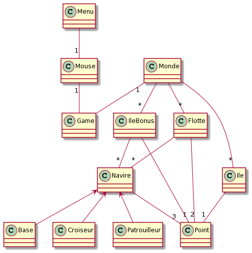

# Game : Master & Commander

Un jeu de bateau style RTS crée pour le troisième semestre de notre formation à la Faculté des Sciences et Technologies de Vandoeuvre-lès-Nancy (54500 France).

## Description du jeu
Vous jouez contre l'ordinateur.

Le but est de détruire la base des autres flottes.

Pour cela vous pouvez acheter, avec de l'or, 2 types de bateaux différents, un Patrouilleur, et un Croiseur (qui a de meilleures capacités que le Patrouilleur).

L'or est gagné au fur et à mesure de la partie.

Vous pouvez attaquer une ile protégée par des bateaux afin de la contrôler et gagner plus d'or. Attention, vous pouvez perdre le contrôle et donc le bonus si une autre flotte attaque cette ile.

Des iles qui ne donnent pas de bonus (donc non protégées) sont aussi présentent.

Une fois les bases des adversaires détruites ou la destruction de votre base, le jeu s'arrête et le gagnant est affiché sur la sortie standard.

Si vous revenez au menu ou quittez l'application, votre partie est sauvegardée, vous pouvez la recharger plus tard.
Attention si vous démarrez une nouvelle partie, toute partie sauvegardée sera supprimé !

### Dépendances

OS : Windows/Linux
SDL et SDL_TFF

### Installer et Executer le jeu

* Placez vous dans le répertoire contenant le fichier MakeFile
* Ouvrez un terminal
* Entrez la commande suivante pour compiler le jeu :
```
make main
```
* Entrez la commande suivante pour executer le jeu :
```
./main
```

## Comment jouer ?

### Dans le menu

#### Touches claviers disponibles : 
* Flèche du HAUT : sélectionner la catégorie précédente
* Flèche du BAS : sélectionner la catégorie suivante
* ENTRER : lancer la sélection
* ECHAP : quitter l'application

#### Touches souris disponibles :  
* Mouvements Souris : sélectionner la catégorie pointée
* Clic GAUCHE : lancer la catégorie selectionnée

### En jeu

#### Touches claviers disponibles : 
* ECHAP : revenir au menu (Sauvegarde la partie en cours)
* SUPPR : supprime la sélection actuelle de bateaux
* RETOUR : annule l'ordre de déplacement des bateaux sélectionnés

#### Touches souris disponibles : 
Sur la partie interface (en haut) :
* Clic GAUCHE : acheter le bateau ou l'amélioration pointée de la souris
Sur la partie jeu (en bas) :
* Clic GAUCHE + Mouvement Souris + Relâchement Clic GAUCHE : sélectionner les bateaux alliés dans la zone rectangulaire dessinée à la souris
* Clic GAUCHE : sélectionner un bateau pointé par la souris
* Clic DROIT : ordonner aux bateaux sélectionnés de se déplacer à l'endroit pointé (si on ne pointe pas une ile ou une base)

## Détail technique
### Diagramme de classe simplifié




## Auteurs
[STEINER Hugues](https://github.com/Hugues-STEINER) </br>
[LESNIAK Louis](https://github.com/LESNIAK-Louis)
